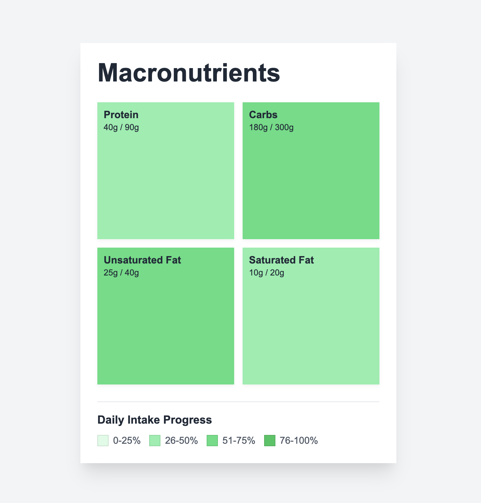
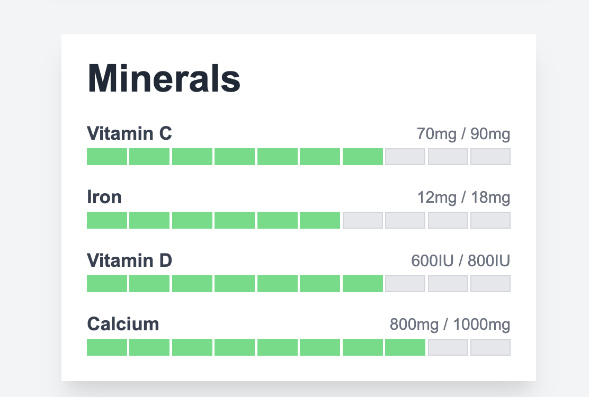

# Health UI Components – Svelte

This project is a simple collection of reusable UI components built using [Svelte](https://svelte.dev/). The purpose is to explore ideas for a health tracking app — things like tracking performance, follow-through, or other metrics visually.

All components are stored in `src/lib` and displayed through the main route at `src/routes/+page.svelte`.

## Project Summary

This is not a production app. It's a playground for prototyping lightweight, reusable interface elements like progress cards, metric displays, and status indicators using Svelte.

You can view the components live by running the development server below.

## Getting Started

Install dependencies and run env:

```sh
npm install
npm run dev
```

## Images of Components






